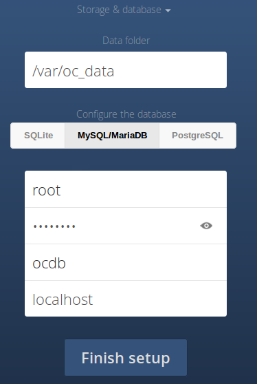

# Introduction
{:.no_toc}

This is a quick start installation guide for ownCloud Server on a single server and single database setup.

Additional installation options are covered with the [ownCloud Administration Guide](https://doc.owncloud.org/server/10.4/admin_manual/installation/deployment_recommendations.html).

For mid-sized and enterprise scaling and high availability options, see [Deployment Considerations](https://doc.owncloud.org/server/10.4/admin_manual/installation/deployment_considerations.html) and [Deployment Recommendations](https://doc.owncloud.org/server/10.4/admin_manual/installation/deployment_recommendations.html).

Let's get started.

- 
{:toc}

# System Requirements

## Official Recommended Environment

We officially recommend and support:

|**Platform**   |**Options**   |
|---|---|
|**Operating System**   |Ubuntu 18.04 LTS   |
|**Database**   |MariaDB 10+   |
|**Web server**   |Apache 2.4 with [prefork and mod_php](https://doc.owncloud.org/server/10.4/admin_manual/installation/manual_installation.html#multi-processing-module-mpm)   |
|**PHP Runtime**   |7.3   |

> **Recommendation**: To install in this environment, please see  [**Recommended Standard: Ubuntu 18.04**](#recommended-standard-ubuntu-1804) Installation Guide.

## Official Supported Environments

### Server

**Operating System (64bit)**

- Debian 9 and 10
- Fedora 30 and 31
- Red Hat Enterprise Linux/Centos 7.5 and 8
- SUSE Linux Enterprise Server 12 with SP4 and 15
- Ubuntu 16.04 and 18.04
- openSUSE Leap 42.3 and 15

**Database**

- MySQL 8+ or MariaDB 10+ (Recommended)
- Oracle 11 and 12
- PostgreSQL 9 and 10
- SQLite (Not for production)

**Web server**

- Apache 2.4 with [prefork and mod_php](https://doc.owncloud.org/server/10.4/admin_manual/installation/manual_installation.html#multi-processing-module-mpm)

**PHP Runtime**

- 7.1, 7.2, and 7.3

> **Note for Linux distributions**: We support two latest plus the current Long Term Support (LTS) versions.

### Hypervisors

- Hyper-V
- VMware ESX
- Xen
- KVM

### Desktop Sync Client

We recommend using the latest version of the Desktop Sync Client. The latest stable client supports the platforms listed below:

- **Linux**
  - CentOS 7.6+ & 8
  - Debian 9.0 & 10
  - Fedora 30 & 31 & 32
  - Ubuntu 18.04 & 19.04 & 19.10 & 20.04
  - openSUSE Leap 15.0 & 15.1 & 15.2
- **Apple** **macOS** X 10.10+ (**64-bit only**)
- **Microsoft Windows** 7+

### Web Browser

- Edge (current version on Windows 10)
- IE11 or newer (except Compatibility Mode)
- Firefox 60 ESR+
- Chrome 66+
- Safari 10+

### Mobile Apps

We recommend using the latest version of the Mobile App. The latest stable mobile apps support the platforms listed below:

- iOS 9.0+
- Android 4.4+

> **Tip**: For more information on changes within version updates, please visit our [changlogs](https://owncloud.org/changelog/).

## Database Requirements

mySQL/MariaDB requirements:

- `BINLOG` Disabled or `BINLOG_FORMAT = MIXED` or `BINLOG_FORMAT = ROW` configured Binary Logging (See: [MySQL / MariaDB with Binary Logging Enabled](https://doc.owncloud.org/server/10.4/admin_manual/configuration/database/linux_database_configuration.html#enabling-binary-logging))
- InnoDB storage engine (**Note**: MyISAM storage engine is not supported, see: [MySQL / MariaDB storage engine](https://doc.owncloud.org/server/10.4/admin_manual/configuration/database/linux_database_configuration.html#configuring-the-storage-engine))
- `READ COMMITED` transaction isolation level (See: [MySQL / MariaDB `READ COMMITED` transaction isolation level](https://doc.owncloud.org/server/10.4/admin_manual/configuration/database/linux_database_configuration.html#set-read-commited-as-the-transaction-isolation-level))

## Memory Requirements

For a single server setup:

**Minimum requirement**:  128GB

**Recommended**: 512GB

# Installation

## Download and Extraction

- Visit [ownCloud Download Page](https://owncloud.org/install).

- Click on **Download ownCloud Server > Download > Archive file for server owners** and download either the tar.bz2 or .zip archive.

- The downloaded file will be named either owncloud-x.y.z.tar.bz2 or owncloud-x.y.z.zip (where x.y.z is the version number).

- Download the corresponding checksum file, e.g., owncloud-x.y.z.tar.bz2.md5, or owncloud-x.y.z.tar.bz2.sha256.

- Verify the MD5 or SHA256 sum:

  ```
  md5sum -c owncloud-x.y.z.tar.bz2.md5 < owncloud-x.y.z.tar.bz2
  sha256sum -c owncloud-x.y.z.tar.bz2.sha256 < owncloud-x.y.z.tar.bz2
  md5sum  -c owncloud-x.y.z.zip.md5 < owncloud-x.y.z.zip
  sha256sum  -c owncloud-x.y.z.zip.sha256 < owncloud-x.y.z.zip
  ```

- You may also verify the PGP signature:

  ```
  wget https://download.owncloud.org/community/owncloud-x.y.z.tar.bz2.asc
  wget https://owncloud.org/owncloud.asc
  gpg --import owncloud.asc
  gpg --verify owncloud-x.y.z.tar.bz2.asc owncloud-x.y.z.tar.bz2
  ```

- Now you can extract the archive contents. Run the appropriate unpacking command for your archive type:

  ```
  tar -xjf owncloud-x.y.z.tar.bz2
  unzip owncloud-x.y.z.zip
  ```

- This will unpack to a single `owncloud` directory. Copy the ownCloud directory to its final destination. When you are running the Apache HTTP server, you may safely install ownCloud in your Apache document root:

  ```
  cp -r owncloud /path/to/webserver/document-root
  ```

  where `/path/to/webserver/document-root` is replaced by the document root of your Web server:

  ```
  cp -r owncloud /var/www
  ```

On other HTTP servers, it is recommended to install ownCloud outside of the document root.

## Configuring Webserver

There are two ways to configure Apache.

### Configure Apache

1\. Create a `/etc/apache2/sites-available/owncloud.conf` file with the following lines:

```apache
Alias /owncloud "/var/www/owncloud/"

<Directory /var/www/owncloud/>
  Options +FollowSymlinks
  AllowOverride All

 <IfModule mod_dav.c>
  Dav off
 </IfModule>
</Directory>
```

2\. Then create a symlink to /etc/apache2/sites-enabled:

```
ln -s /etc/apache2/sites-available/owncloud.conf /etc/apache2/sites-enabled/owncloud.conf
```

> **Note**: For additional Apache configurations including `mod_unique_id`, enabling SSL and Multi-Processing Module (MPM) considerations, please see [Additional Apache Configuration](https://doc.owncloud.org/server/10.4/admin_manual/installation/manual_installation.html#additional-apache-configurations).

3\. Restart Apache

### Configure Apache to listen on a different port

You can run ownCloud on its own port in Apache. For example: 8080.

1\. In `/etc/apache2/ports.conf`, add the additional line right below `Listen 80`

`Listen 8080`

2\. Edit the `/etc/apache2/sites-available/owncloud.conf` file by changing the top line to:

`<VirtualHost *: 8080>`

3\. Restart Apache.

## Before you install

Change the `owncloud` directory ownership to your HTTP user:

```
chown -R www-data:www-data /var/www/owncloud/
```

> **Note**: For additional Prerequisites including Apache, PHP, or Database, please refer to: [Running the Installation Wizard](https://doc.owncloud.org/server/10.4/admin_manual/installation/manual_installation.html#run-the-installation-wizard)

Now, you have three ways to complete the installation:
- [**The Installation Wizard**](#the-installation-wizard)
- [**Command Line Installation**](#command-line-installation)
- [**Recommended Standard: Ubuntu 18.04**](#recommended-standard-ubuntu-1804)

> **Note:** To install with Docker, please see [**Installing with Docker**](https://doc.owncloud.org/server/10.4/admin_manual/installation/docker/).

## The Installation Wizard

### Introduction

> **Recommendation**: If you are planning to use the installation wizard, we **recommend** that you protect it by enabling password authentication or through network access control. 

### Web Access

1. In your web browser, go to `http://localhost/owncloud`
2. Create an admin account with your desired username and password
3. Click **[Finish setup]**

### Data Directory

At the top drop down menu, select 'Storage & Database' to specify data folder and to configure the database. 

> **Note**: The directory must be already created and must be owned by the HTTP user.



> **Important**: The data folder and content must be exclusive to ownCloud server. No other process or user can alter the directory's contents.

### mySQL/MariaDB Database

MariaDB is the ownCloud recommended database server. You can use it for either Server or Enterprise editions. To install the recommend MariaDB database server, use the following command (for Debian/Ubuntu servers):

```
sudo apt-get install mariadb-server
```

> **Note**: will need to use a user login with permissions to create and modify databases. 

1. Choose "Storage & Database."
2. Enter in DB user and password
3. Enter in your own database name 

You can setup a temporary database administrator account with the following steps:

```
sudo mysql --user=root mysql
CREATE USER 'dbadmin'@'localhost' IDENTIFIED BY 'APASSWORD';
GRANT ALL PRIVILEGES ON *.* TO 'dbadmin'@'localhost' WITH GRANT OPTION;
FLUSH PRIVILEGES;
exit
```

For more detailed information, see [MySQL/MariaDB Configuration](https://doc.owncloud.org/server/10.4/admin_manual/configuration/database/linux_database_configuration.html#mysql-mariadb).

For SQLite, PostgreSQL, and Oracle 11g database configuration, see [Database Choices](https://doc.owncloud.org/server/10.4/admin_manual/installation/installation_wizard.html#database-choices).

### Post-Installation

After install, we **recommend** taking extra hardened security measures. See [Post-Installation Guide](https://doc.owncloud.org/server/10.4/admin_manual/installation/installation_wizard.html#post-installation-steps) for step-by-step instructions.

## Command Line Installation

For scripted and automated operations, use command line installation.

Five steps for command line installation:

1. Ensure your server meets [the ownCloud prerequisites](https://doc.owncloud.org/server/10.4/admin_manual/installation/manual_installation.html#prerequisites)
2. Download and unpack the source
3. Install using the `occ` command
4. Set the correct owner and permissions
5. Optional post-installation considerations

Let's get started.

1\. Download and unpack the source into an directory (e.g. `/var/www/owncloud`)

2\. Change the owner for your unpacked `owncloud` directory with your HTTP user: 

```
$ sudo chown -R www-data:www-data /var/www/owncloud/
```
3\. Use `occ` command to perform the installation:

```console
# Assuming you’ve unpacked the source to /var/www/owncloud/
$ cd /var/www/owncloud/
$ sudo -u www-data php occ maintenance:install \
   --database "mysql" --database-name "owncloud" \
   --database-user "root" --database-pass "password" \
   --admin-user "admin" --admin-pass "password"
```

> **Note**: You must run `occ` as [your HTTP user](https://doc.owncloud.org/server/10.4/admin_manual/installation/manual_installation.html#set-strong-directory-permissions).

If you want to use a different data directory, supply the `--data-dir` switch.

When the command completes, [apply the correct permissions](https://doc.owncloud.org/server/10.4/admin_manual/installation/manual_installation.html#set-strong-directory-permissions) to your ownCloud files and directories.

> **Important**: Applying the correct permissions will protect your install.

## Recommended Standard: Ubuntu 18.04

If you intend to run our recommended standard, see [Install ownCloud on Ubuntu 18.04](https://doc.owncloud.org/server/10.4/admin_manual/installation/ubuntu_18_04.html).

# Administration

##  How do I add another user?

1\. Click on **&#8801;** the upper-left corner of the web interface and click on 'Users'

2\. At the top-middle of the page, fill in the following information:

- Username
- Email address
- Select which group
- Click on 'Create' button

## How do I install and connect with the Desktop Synchronization Client?

1\. See our [Desktop Sync guide](https://doc.owncloud.com/desktop/installing.html) for installation instructions.

2\. When prompted, fill in the following information:

- Server address: `https://<servername or ipaddress>/owncloud/`
- Username
- Password
- Select 'Sync everything from server' or 'Choose what to sync'
- Select Local Folder (Default: `<Home Directory>/owncloud`)
- Click 'Connect' button

## How do I install and connect with a Mobile app?

Choose your guide and follow the installation and configuration directions:

- Android [guide](https://doc.owncloud.com/android/)
- iOS (iOS 11+) [guide](https://doc.owncloud.com/ios-app/)
- iOS (Legacy) [guide](https://doc.owncloud.com/ios/)